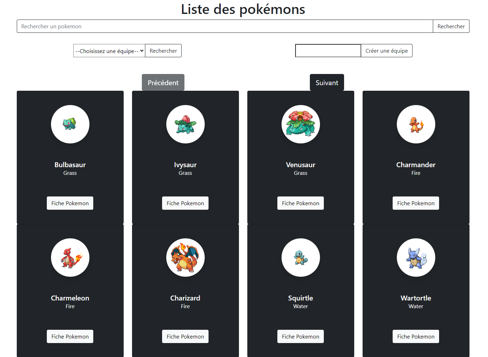

# PokeApp

Projet réalisé par Baptiste Lecat - François-Xavier Pelet.

Accès partie ADMIN:

Identifiant : baptiste
Mot de passe : baptiste
## Introduction

Dans le cadre de la validation d'un module Python au sein de l'école EPSI, j'ai réalisé un site web en DJANGO. Ce dernier permet de visualiser une liste de pokemon provenant de l'api [pokeAPI](https://pokeapi.co/)

## Contraintes

Ce projet doit répondre à plusieurs contraintes :

- Afficher une liste de pokémons avec un système permettant de parcourir au moins les 150 premiers résultats.
- Recherche d'un pokemon par son nom.
- Visualiser un pokemon en particulier : afficher ses informations (image, nom, taille, capacités...).
- Créer une équipe de pokémons :
    - Ajouter des pokémons.
    - Retirer des pokémons.

## Fonctionnalités

### Affichage de la liste des pokémons

- /pokemons - Permet d'afficher la liste des pokémons

Pour réaliser cette page j'ai choisi d'utiliser un système de pagination. En utilisant les attributs "next" et "previous" renvoyer par l'api sur l'appel "https://pokeapi.co/api/v2/pokemon", j'ai pu sauvegarder ces informations en session. Ainsi à chaque pression sur le bouton "PRECEDENT" ou "SUIVANT", si il existe ces attributs en session, leur valeur sera utilisé comme URL pour l'appel de chargement des données.
Cette URL renvoyée par l'API comporte les attributs : limit et offset.
J'ai choisi de fixer LIMIT à 10 pour n'avoir que 10 pokémons par page.
L'offset est quand à lui dynamique et incrémenté par l'API en fonction de la valeur de LIMIT.

J'utilise ensuite la liste des URL renvoyées pour appeler successivement chacune d'elles et construire une mini-carte pour chaque pokemon, avec une image son nom et son type. 

Le champ de recherche:
En indiquant le nom du pokemon souhaité il est possible d'accéder à sa fiche information. La valeur du champ est passée à la vue DJANGO par la méthode HTTP GET. Ainsi l'appel API suivant est constitué.
"https://pokeapi.co/api/v2/pokemon/NOMDUPOKEMON"

### Création d'une équipe

Sur la page présentant la liste des pokémons, il est possible d'enregistrer une nouvelle équipe en renseignant un nom.

### Affichage des pokémons d'une équipe

Sur cette même page il est possible de sélectionner une équipe pour afficher les fiches des différents pokémons membre de cette équipe.
J'utilise l'URL enregistré dans l'entité pokemonSelected pour pouvoir charger les données depuis l'API.

### Suppression d'un pokémons d'une équipe

Après avoir affiché la liste des pokémons membre d'une équipe il est possible de le supprimer de cette dernière.

### Affichage de la fiche d'un pokemon

- /pokemons/IDPOKEMON/ - Permet d'afficher la fiche d'un pokemon

Cette page permet de visualiser l'image du pokemon sélectionné, mais aussi son nom ses attaques et certaines informations générales.
J'ai utilisé la librairie MATHFILTERS pour permettre de convertir les données telles que la taille ou le poids dans une unité universelle : mètres et kilos.
Les informations concernant les attaques du pokémons sont chargées en bouclant sur la liste d'url renvoyée par l'API :
"https://pokeapi.co/api/v2/ability/150/"

### Ajout d'un pokemon à une équipe

Sur cette même page il est possible de sélectionner une équipe et d'y ajouter le pokemon selectionné.
Un appel en POST vers la vue DJANGO permet ensuite d'effectuer un traitement et de verifier si l'équipe existe, que le pokemon existe et enfin que celui-ci n'est pas déjà présent dans cette équipe.
Ce pokemon est ensuite sauvegardé dans la base de données DJANGO avec l'attribut team contenant l'identifiant de l'équipe dans laquelle il a été ajouté.
L'id du pokemon est le même que celui renvoyé par l'API.
## Documentation

L'application /pokesite/pokemon/ contient le code du projet.
Le fichier views répertorie les diverses fonctions appelées par les urls du fichier urls.py.

### Désérialisation

Pour pouvoir utiliser les données de l'API sous la forme d'objet, les entités présentes dans le dossier /pokesite/pokemon/src/model/ sont la stricte représentation du modèle de données employé par l'API. Néanmoins j'ai choisi de ne pas désérialiser certaines données que j'ai jugées peu pertinente pour le projet.

Les méthodes from_dict permettent donc la déserialisation.

    @staticmethod
    def from_dict(obj: Any) -> 'Pokemon':
        assert isinstance(obj, dict)
        id = from_int(obj.get("id"))
        name = from_str(obj.get("name"))
        base_experience = from_int(obj.get("base_experience"))
        height = from_int(obj.get("height"))
        is_default = from_bool(obj.get("is_default"))
        order = from_int(obj.get("order"))
        weight = from_int(obj.get("weight"))
        abilities = from_list(Ability.from_dict, obj.get("abilities"))
        forms = from_list(Species.from_dict, obj.get("forms"))
        game_indices = from_list(GameIndex.from_dict, obj.get("game_indices"))
        location_area_encounters = from_str(
            obj.get("location_area_encounters"))
        moves = from_list(Move.from_dict, obj.get("moves"))
        species = Species.from_dict(obj.get("species"))
        sprites = Sprites.from_dict(obj.get("sprites"))
        stats = from_list(Stat.from_dict, obj.get("stats"))
        types = from_list(TypeElement.from_dict, obj.get("types"))
        return Pokemon(id, name, base_experience, height, is_default, order, weight, abilities, forms, game_indices, location_area_encounters, moves, species, sprites, stats, types, None)

### Intérogation de l'API

Les méthodes permettant d'interroger l'API sont consignées dans le dossier repository (/pokesite/pokemon/src/repository), ainsi chaque entité hydratée dispose de son repository.

### Base de données

Les données propres au projet sont stockées dans une base de données générée par le framework. Ainsi les entités Team et pokemonSelected décrites dans le fichier /pokesite/pokemon/models.py permettent la gestion du système d'équipe.

## Environnement

Ce projet utilise un Venv pour pouvoir charger l'ensemble des librairies associées. Il vous faut donc activer ce dernier pour pouvoir lancer le serveur local.
Pour ce faire sur Windows depuis la racine du projet exécutez les commandes suivantes:

$ .\pokeapp\Scripts\activate
$ cd .\pokesite
$ python manage.py runserver

Au préalable il est nécessaire de modifier le chemin d'accès vers votre Python. (dans le fichier /pokeapp/pyvenv.cfg)

